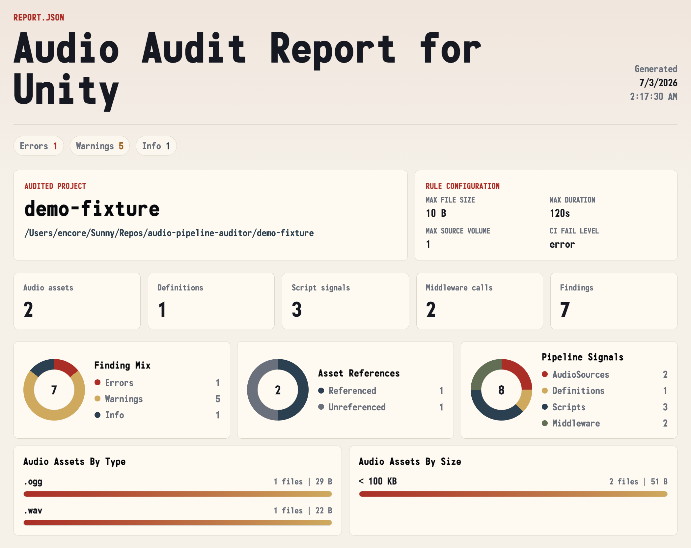

# Audio Pipeline Auditor

A small TypeScript CLI for auditing Unity projects that use built-in audio or lightweight custom audio systems.

This project is a work in progress. Expect the scanner, report UI, and middleware coverage to evolve as more Unity project shapes are tested.



The CLI command is:

```bash
audio-audit
```

## What It Checks

- Scan Unity project folders for audio files and Unity text assets.
- Detect oversized audio, unreferenced clips, missing AudioSource clips, unresolved clip GUIDs, missing mixer routing, Play On Awake, and suspicious AudioSource volume.
- Detect audio pipeline architecture: serialized `AudioSource` components, runtime-created Unity audio, ScriptableObject audio definitions, and Wwise artifacts.
- Summarize obvious Wwise and FMOD script calls, including common API names and first string event arguments.
- Build a structured JSON report.
- Render a static React-powered HTML report.
- Return CI-friendly exit codes when findings reach a configured severity.

## Commands

```bash
npm install
npm run build
npm run dev
npm run dev:cli -- init
npm run dev:cli -- scan ./MyUnityProject --out ./audio-audit-report
npm run dev:cli -- validate-config ./audio-audit.config.json
```

`npm run dev` builds the demo report and serves it with Vite so the report UI can be tested in a browser.

`npm run dev:report` serves the existing `demo-site` folder without rebuilding it.

## Quick Start on a Unity Project

From this repo during local development:

```bash
npm install
npm run build
node dist/cli.js init
node dist/cli.js scan /path/to/MyUnityProject --out /path/to/MyUnityProject/audio-audit-report
```

Then open:

```txt
/path/to/MyUnityProject/audio-audit-report/index.html
```

After the package is published or installed globally, the same workflow becomes:

```bash
audio-audit init
audio-audit scan /path/to/MyUnityProject --out /path/to/MyUnityProject/audio-audit-report
```

The generated report includes `schemaVersion: "0.1.0"` in `report.json` so future report viewers can handle report shape changes deliberately.

## Reports

Audio Pipeline Auditor scans your Unity project locally or in CI. It does not require uploading your Unity project to a website.

Each scan writes a static report folder with `index.html` and `report.json`. Open `index.html` locally, upload the folder as a CI artifact, or host the generated report on any static file host.

The GitHub Pages site for this repository is only a demo of the report UI:

```txt
https://l1ryx.github.io/audio-pipeline-auditor/
```

## Limitations

- Unity assets must be serialized as text for scene, prefab, and asset scanning to be useful.
- Audio metadata depends on what `music-metadata` can read from the discovered files.
- Wwise and FMOD support is intentionally lightweight: the scanner summarizes obvious script calls, common component names, and simple artifacts, but it does not parse full Wwise projects, FMOD Studio projects, or bank contents.
- The report is a static snapshot. It does not watch project files or upload project contents.
